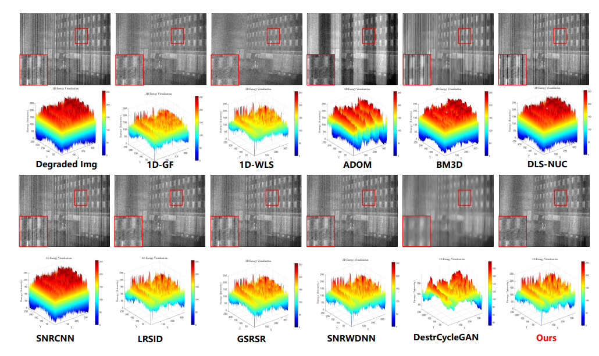
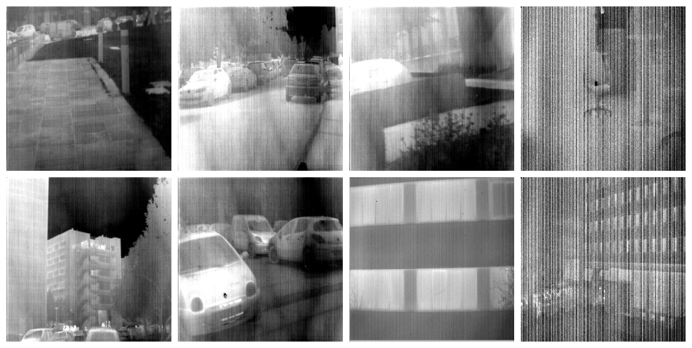
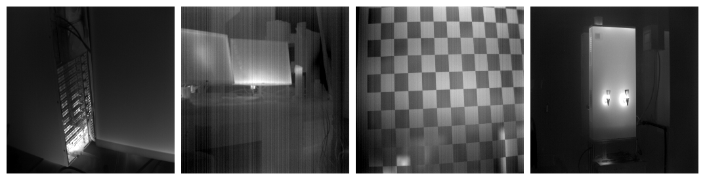
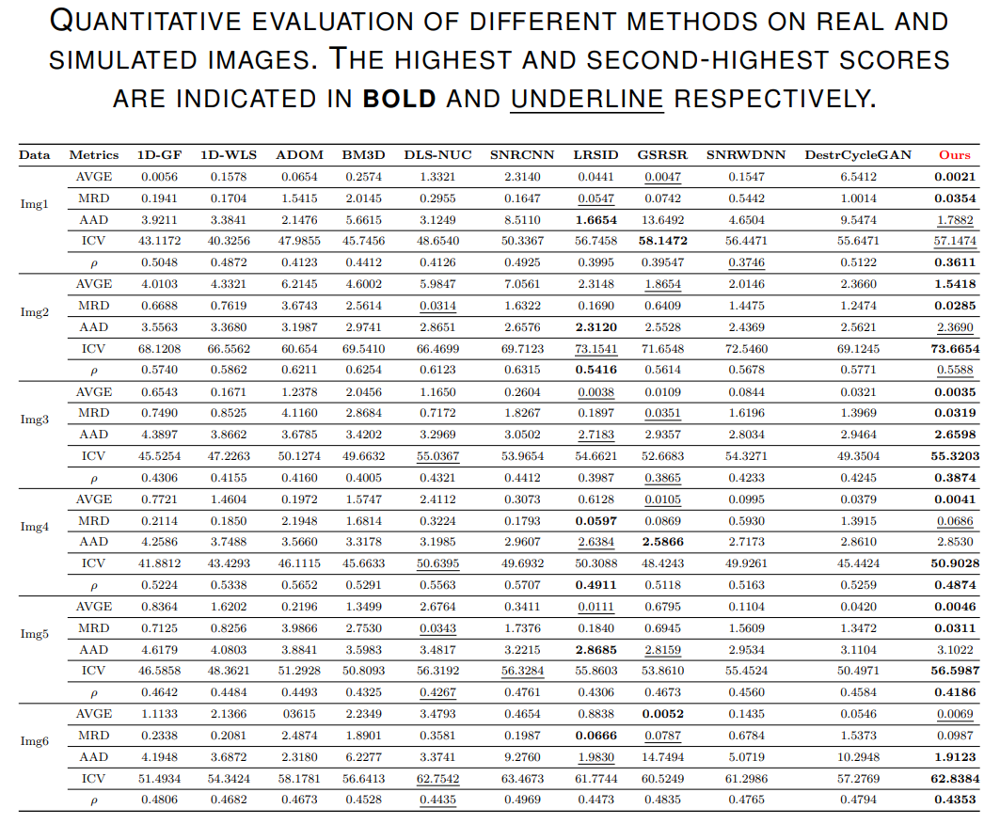

# Note  

We have  named the model **MNUCP** (Multi-stage non-uniformity correction pipeline)!    
We have  named the model **MNUCP** (Multi-stage non-uniformity correction pipeline)!    
We have  named the model **MNUCP** (Multi-stage non-uniformity correction pipeline)!   
**You can use this abbreviation when comparing this model in your experiments. Thank you!!！**


We have provided both MATLAB and C++ code. The MATLAB code runs perfectly, but the C++ code is currently experiencing formatting errors during conversion, with some parts going out of bounds. I will fix these issues and upload a perfect C++ version as soon as possible!

# Update 
2025.12.10
Upload the simulated noise code  
Note: Our simulation code does not provide batch processing, please make modifications based on this.  
2025.04.10   

Our manuscript has been accepted and is online in advance, although it is not a fully proofed version. We will release the dataset and evaluation metric code in the near future.  

# Infrared_NUC
A non-uniform correction framework for Single-frame  Infrared images    

Infrared_NUC code  ,Submitted to IEEE Sensors Journal (accepted)   


We will publicly disclose all code and resources after the paper is accepted. Thank you for your attention.  


If you'd like to read about hybird  denoising in infrared images, you can check out this link.    
[https://github.com/ImageVisioner/InfraredNUC/   ](https://github.com/ImageVisioner/IRdenoise)


**Results** 

<center>

</center>


**Dataset** 

We used both real and simulated datasets The simulation dataset is generated by code. We will release all simulation codes and datasets after the paper is accepted. Theoretically, it can be applied to all images. Including optical  images, multispectral images, infrared images, and microwave images.

We will release all simulation datasets after the paper is fully accepted. You can preview them now by clicking this link. If you need them urgently, please contact us by email.

https://github.com/ImageVisioner/IR-non-uniformity

***Real images***
 


**dataset1**


<center>

</center>


**dataset2**


<center>

</center>


***Simulated images***
This is our simulation and correction test results on the LLVIP dataset.


<center>

</center>


```
@inproceedings{llvip,
  title={LLVIP: A visible-infrared paired dataset for low-light vision},
  author={Jia, Xinyu and Zhu, Chuang and Li, Minzhen and Tang, Wenqi and Zhou, Wenli},
  booktitle={Proceedings of the IEEE/CVF international conference on computer vision},
  pages={3496--3504},
  year={2021}
}

```


**Evaluation Metrics**

We will release our evaluation code after the manuscript is accepted.
Additionally, you can find the metrics for image evaluation in this link, which will include the NUC metric.

We rewrote the evaluation metric in MATLAB and will release the code once the paper is fully accepted. Click below for a preview link.

https://github.com/ImageVisioner/Image_Fusion_Evaluation_modify
https://github.com/ImageVisioner/IR-non-uniformity


<center>

</center>


**Contact**   
If you encounter any problems during use, please do not hesitate to email me.     
Email:imagevisioner@outlook.com    or lh_010625@163.com

**References** 
If our work is useful to you please cite us.  

will come soon


**Acknowledgments**   

Our work has benefited from the National Natural Science Foundation of China.  Please cite when it is helpful to you.

``` 
@article{liu2025multi,
  title={Multi-stage non-uniformity correction pipeline for single-frame infrared images based on hybrid high-order directional and low-rank prior information},
  author={Liu, Chenhua and Li, Hao and Li, Maoyong and Deng, Lei and Dong, Mingli and Zhu, Lianqing},
  journal={IEEE Sensors Journal},
  year={2025},
  publisher={IEEE}
}
```

@article{liu2026infrared,
  title={Infrared image denoising: A hybrid noise removal pipeline with anti-artifact regularization},
  author={Liu, Chenhua and Li, Hao and Li, Maoyong and Deng, Lei and Dong, Mingli and Zhu, Lianqing},
  journal={Optics \& Laser Technology},
  volume={193},
  pages={114174},
  year={2026},
  publisher={Elsevier}
}
``` 


